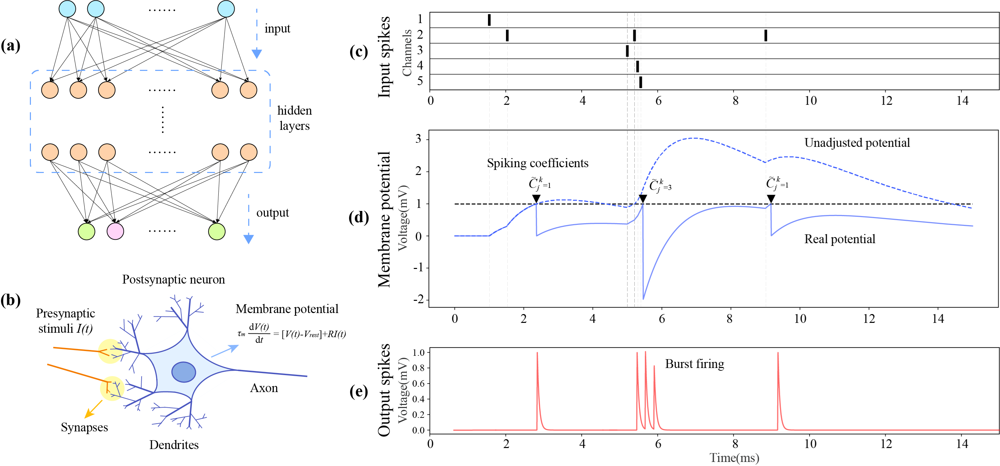
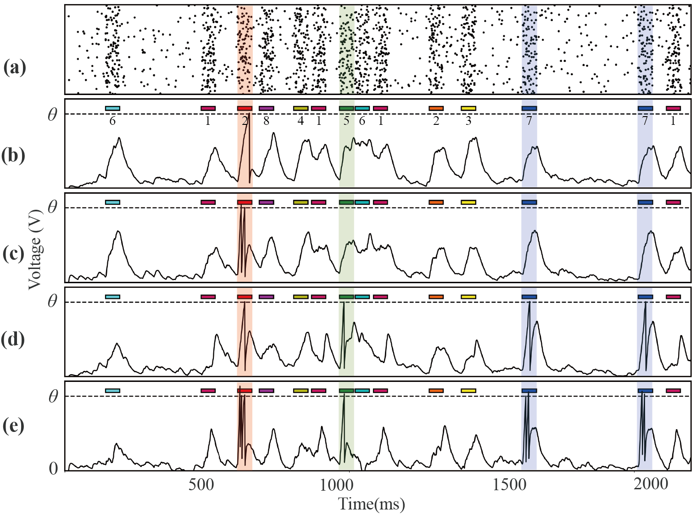

# Synchronized Membrane Potential-driven Plasticity for Spiking Neural Networks

Official MATLAB implementation of **Synchronized Membrane Potential-driven Plasticity (SMDP)** for spiking neural networks.

SMDP is motivated by biological burst firing. It assigns a spiking coefficient to each spike event, allowing a neuron to emit multiple spikes at the same time. The repository includes single-layer and multilayer experiments on MNIST, Fashion-MNIST, and UCI classification datasets.

<p align="center">
  
</p>

<p align="center">
  
</p>

## Repository structure

| Directory | Experiments |
| --- | --- |
| `single-MNIST/` | Single-layer SNN on MNIST |
| `muti-MNIST/` | Multilayer SNN on MNIST |
| `single-fashionMNIST/` | Single-layer SNN on Fashion-MNIST |
| `muti-fashionMNIST/` | Multilayer SNN on Fashion-MNIST |
| `single-UCI/` | Single-layer SNN on UCI datasets |
| `multi-UCI/` | Multilayer SNN on UCI datasets |
| `images/` | Architecture and method figures |

The directory names are retained from the original implementation so that relative paths in the MATLAB scripts continue to work.

## Requirements

- MATLAB
- Statistics and Machine Learning Toolbox (for functions such as `normrnd` and `unifrnd`)
- CPU execution is supported; no GPU-specific code is required

The code has no package installation step.

## Data

The MNIST and encoded UCI data used by the included scripts are provided in the corresponding experiment directories.

The Fashion-MNIST scripts expect a file named `FashionMNIST.mat` in each Fashion-MNIST experiment directory. That file is not included in the current repository. It should contain:

- `train_pattern`: training images arranged by column
- `train_labels`: training labels
- `test_pattern`: test images arranged by column
- `test_labels`: test labels

## Running an experiment

1. Open MATLAB.
2. Change the current folder to the experiment directory you want to run.
3. Run the corresponding entry-point script.

For example:

```matlab
cd('single-MNIST')
single_MNIST_experiment
```

Main entry points include:

- `single-MNIST/single_MNIST_experiment.m`
- `muti-MNIST/muti_MNIST_experiment.m`
- `single-fashionMNIST/single_FashionMNIST_experiment.m`
- `muti-fashionMNIST/muti_fa_mnist_experiment.m`
- `single-UCI/bupa_single_experiment.m`
- `single-UCI/iono_single_experiment.m`
- `single-UCI/wbc_single_experiment.m`
- `multi-UCI/bupa_muti_experiment.m`
- `multi-UCI/iono_muti_experiment.m`

Experiment parameters, including learning rates, network sizes, epoch counts, and trial counts, are defined near the top of each entry-point script. Several scripts use random initialization and random train/test ordering; set the MATLAB random seed before execution when deterministic reruns are needed.

## Citation

Citation information will be added when the paper's final bibliographic record is available.

## License

No open-source license has been specified for this release. All rights are reserved by the copyright holders unless a license is added later.
